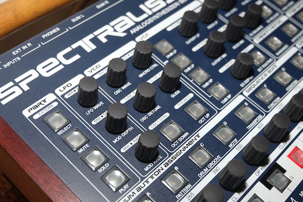

# raditecSDB
Radikal Technlologies Spectralis reference book

<font size="5em">Open document format [SPC-databook.odt](SPC-databook.odt)</font>



## See also

My other spectralis-related repositories: reverse engineering the SPT data format [raditecSPT](/zenpho/raditecSPT), and an editor for groove and line sequences [raditecSBG](/zenpho/raditecSBG), and a tool for importing SMF standard midi files to spectralis hardware [raditecSMF](/) useful in conjunction with the `CREATIVATOR` feature.

## What is the Spectralis?
From the manual: Radikal Technologies Spectralis is a "performance-oriented music instrument with multiple sequencer-sections [and] sampling engine [...] A pattern-based 17-track sequencer [for drums and] 32 track analog-style step-sequencer which not only plays notes, but can modulate most of the soundparameters of the Spectralis."

The front panel provides numerous push-buttons and rotary encoder controls (also with push-button functions) and the Spectralis OS v1.04k can display a series of menus (tagged with a page number of the total available e.g. page 2/27).

## How to use this document

There is a clear structured design to the spectralis interface, revealed in this document.

Every menu screen (page) and thus every adjustable or displayable parameter value in the SPC OS v1.04k is listed here. 

In my workspace, I print out and keep this next to the hardware or view on screen using "find" or "search" functions to locate the name or description or label of a desired parameter or label.

Each listing in the document includes a heading (and if appropriate, a brief note) providing instructions to invoke the display/adjustment the parameter on the physical hardware front panel. Simply follow the described button/encoder presses accordingly. 

The example shown below describes first pressing a labelled `BUTTON` in the labelled `AREA` on the front panel.

```
BUTTON
AREA
	1/x:LCD after pushing Button
	^Enc1  ^Enc2   ^Enc3   ^Enc4	

1/5:^Enc3
	LCD after pushing Enc3		
	.      Foo     Bar     .
```	

This first displays a menu and subsequently pressing the `^Enc3` encoder below the LCD shall reveal the `^Enc3` menu with parameters `Foo` and `Bar` in sub-menu `1/4`. Pressing `[EXIT]` shall step backwards to the previous menu.


